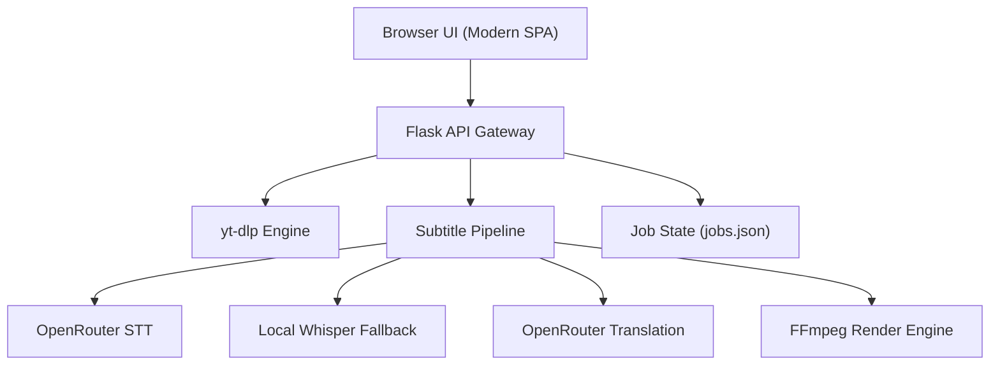

<h1 align="center">🎬 SubClip</h1>
<p align="center">
  <strong>Self-hosted media downloader with AI-powered subtitle generation, live styling, and high-quality burn-in rendering.</strong>
</p>

<p align="center">
  <a href="https://github.com/palamut62/reclip/releases">Releases</a> · 
  <a href="#getting-started">Quick Start</a> · 
  <a href="#configuration">Configuration</a>
</p>

<p align="center">
  
  
  
  
  
  
</p>

---

## 📌 Table of Contents
- [✨ Features](#-features)
- [🛠 Tech Stack](#-tech-stack)
- [📐 Architecture](#-architecture)
- [📁 Project Structure](#-project-structure)
- [🚀 Getting Started](#-getting-started)
- [⚙️ Configuration](#-configuration)
- [📖 Usage Guide](#-usage-guide)
- [🔌 API Overview](#-api-overview)
- [🛣 Roadmap](#-roadmap)
- [⚖️ License](#-license)

---

## ✨ Features

### 📥 Smart Media Downloading
- **Universal Support:** Download media from any platform supported by `yt-dlp`.
- **Flexible Formats:** Direct export as `MP4` (video) or `MP3` (audio).
- **Pre-download Inspection:** View titles, thumbnails, duration, and available quality options before committing to a download.

### ✍️ AI Subtitle Pipeline
- **Cloud-Powered Accuracy:** Integrated with OpenRouter for high-fidelity STT (Speech-to-Text) and translation.
- **Local Fallback:** Automatic failover to `faster-whisper` for offline transcription.
- **Multiple Output Modes:**
  - `SRT`: Standard sidecar subtitle file.
  - `Burn-in`: Subtitles rendered directly into the video stream.
  - `Both`: Hybrid output for maximum flexibility.

### 🎨 Professional Styling Engine
- **Live Visual Preview:** Adjust styles in real-time within the UI before rendering.
- **Deep Customization:**
  - Font family, size, and colors.
  - Precise control over outlines, background boxes, and opacity.
- **Non-Destructive Restyling:** Update visuals using `Apply style` without re-running expensive AI transcription.

---

## 🛠 Tech Stack

| Layer | Technology | Purpose |
| :--- | :--- | :--- |
| **Backend** | `Python 3.12`, `Flask` | API orchestration and job management |
| **Download** | `yt-dlp` | Robust media fetching |
| **Processing** | `FFmpeg` / `ffprobe` | Video encoding and subtitle burn-in |
| **Intelligence** | `OpenRouter` | Cloud STT and LLM-based translation |
| **Fallback** | `faster-whisper` | Local AI transcription |
| **Frontend** | `Vanilla JS`, `CSS3`, `HTML5` | High-performance single-page interface |

---

## 📐 Architecture



---

## 📁 Project Structure

```text
reclip/
├── app.py                  # Flask routes & orchestration
├── subtitle.py             # AI pipeline & burn-in logic
├── templates/
│   └── index.html          # Single-page application UI
├── static/
│   └── subclip.ico         # App branding
├── downloads/              # Output files & runtime state
├── .env.example            # Environment template
└── requirements.txt       # Python dependencies
```

---

## 🚀 Getting Started

### Prerequisites
- **Python 3.10+** (3.12 recommended)
- **FFmpeg** installed and available in your system `PATH`.

### Installation (Windows PowerShell)
```powershell
# Clone and enter the repository
git clone https://github.com/palamut62/reclip.git
cd reclip

# Setup virtual environment
python -m venv venv
.\venv\Scripts\Activate.ps1

# Install dependencies
pip install -r requirements.txt
```

**Install FFmpeg (Quick way):**
```powershell
winget install --id Gyan.FFmpeg -e
```

### Execution
```powershell
python app.py
```
Visit: `http://127.0.0.1:8899`

---

## ⚙️ Configuration

Settings are managed via the `.env` file or directly through the **In-App Settings Modal**.

### Key Environment Variables
| Variable | Description | Default |
| :--- | :--- | :--- |
| `OPENROUTER_API_KEY` | Required for Cloud STT and Translation | `None` |
| `OPENROUTER_MODEL` | Custom LLM for translation | `openai/gpt-4o-mini` |
| `OPENROUTER_STT_MODEL` | Specific Whisper model via OpenRouter | `openai/whisper-large-v3-turbo` |
| `OPENROUTER_STT_CHUNK_SEC` | Audio chunk size for processing | `30` |
| `PORT` | Application server port | `8899` |

---

## 📖 Usage Guide

1. **Fetch:** Paste a URL and click `Fetch video` to see metadata.
2. **Download:** Choose your format (`MP4`/`MP3`) and quality, then click `Download`.
3. **Transcribe:** For video files, click `Add subtitles` to trigger the AI pipeline.
4. **Style:** Open the `Show style` panel, adjust visual settings, and see the live preview.
5. **Render:** Click `Apply style` to burn the customized subtitles into the video.

> **Pro Tip:** `Apply style` only re-renders the video with new visuals; it does **not** consume more API credits as it re-uses the existing transcription.

---

## 🔌 API Overview

| Endpoint | Method | Description |
| :--- | :--- | :--- |
| `/api/info` | `POST` | Retrieve media metadata and quality options |
| `/api/download` | `POST` | Initiate download and optional transcription |
| `/api/subtitle/<id>` | `POST` | Generate subtitles or update styling |
| `/api/status/<id>` | `GET` | Check real-time job progress |
| `/api/file/<id>` | `GET` | Download the final processed media |

---

## 🛣 Roadmap
- [ ] **Multi-language UI:** Full localization support.
- [ ] **Async Queue:** Celery/Redis integration for heavy-duty workloads.
- [ ] **GPU Acceleration:** Automatic detection and use of `nvenc` (NVIDIA) for faster burns.
- [ ] **Batch Processing:** Process multiple URLs in a single session.

---

## ⚖️ License

Distributed under the **MIT License**. See `LICENSE` for more information.

## ❤️ Acknowledgments
- [yt-dlp](https://github.com/yt-dlp/yt-dlp) - The gold standard for media fetching.
- [FFmpeg](https://ffmpeg.org/) - The Swiss army knife of multimedia.
- [OpenRouter](https://openrouter.ai) - Seamless AI model access.
- [faster-whisper](https://github.com/SYSTRAN/faster-whisper) - Efficient local transcription.
