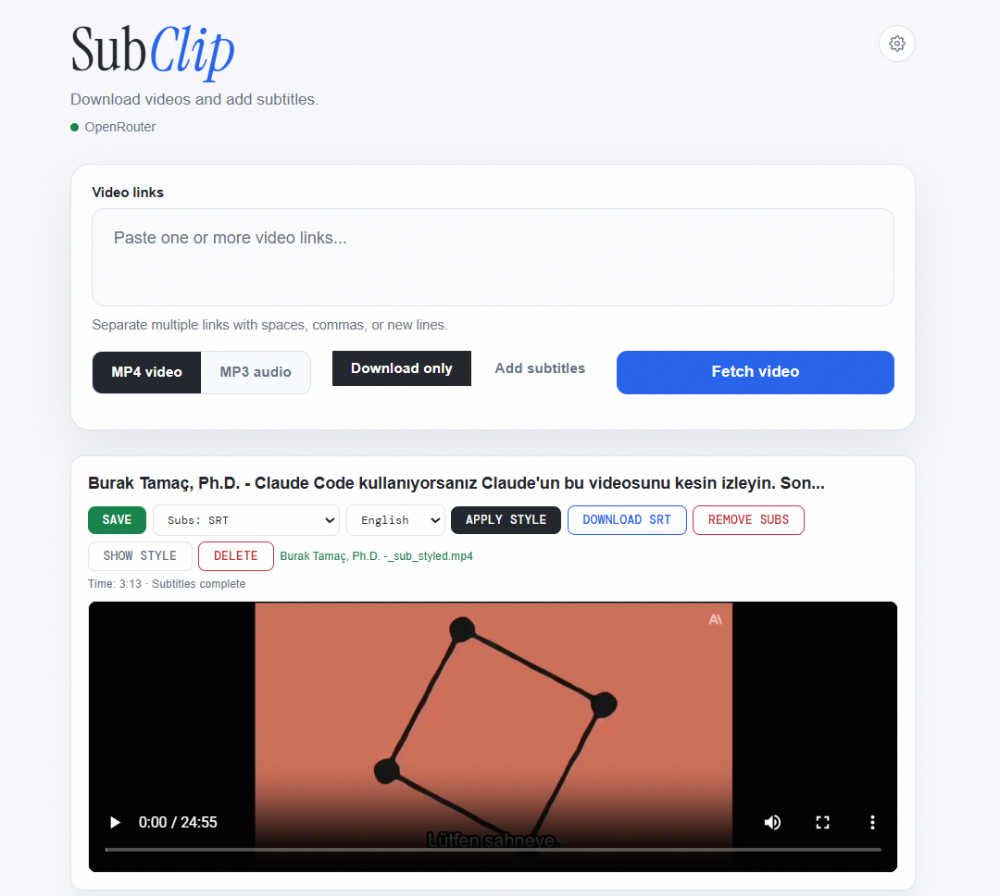
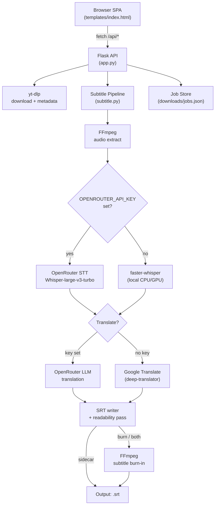

<h1 align="center">🎬 SubClip</h1>

<p align="center">
  <strong>Self-hosted media downloader with an AI subtitle pipeline, live styling, and broadcast-quality burn-in rendering — fully English UI, runs in a single Flask process.</strong>
</p>

<p align="center">
  <a href="#-getting-started">Quick Start</a> ·
  <a href="#%EF%B8%8F-configuration">Configuration</a> ·
  <a href="#-usage-guide">Usage</a> ·
  <a href="#-api-overview">API</a> ·
  <a href="#-troubleshooting">Troubleshooting</a> ·
  <a href="https://github.com/palamut62/subclip/releases">Releases</a>
</p>

<p align="center">
  
  
  
  
  
  
  
  
  
</p>

<p align="center">
  
</p>

<p align="center">
  <sub>SubClip was originally forked from <a href="https://github.com/averygan/reclip">averygan/reclip</a> (MIT) and has since been substantially rewritten, rebranded, and extended. Both copyrights are preserved in <a href="LICENSE"><code>LICENSE</code></a>.</sub>
</p>

---

## 📌 Table of Contents

- [✨ Highlights](#-highlights)
- [🧩 Features](#-features)
- [🛠 Tech Stack](#-tech-stack)
- [📐 Architecture](#-architecture)
- [📁 Project Structure](#-project-structure)
- [🚀 Getting Started](#-getting-started)
- [⚙️ Configuration](#%EF%B8%8F-configuration)
- [📖 Usage Guide](#-usage-guide)
- [🔌 API Overview](#-api-overview)
- [🧪 Testing](#-testing)
- [🚢 Deployment](#-deployment)
- [🛡 Troubleshooting](#-troubleshooting)
- [🔐 Security](#-security)
- [❓ FAQ](#-faq)
- [🛣 Roadmap](#-roadmap)
- [🤝 Contributing](#-contributing)
- [⚖️ License](#%EF%B8%8F-license)
- [❤️ Acknowledgments](#%EF%B8%8F-acknowledgments)

---

## ✨ Highlights

- **One window, full pipeline.** Paste a link → fetch metadata → download → transcribe → translate → style → burn — all from a single browser tab.
- **No local GPU required.** Cloud STT through OpenRouter handles the heavy lifting; local Whisper kicks in only if you want it.
- **Cheap by design.** A typical 4-minute clip ends up costing well under a cent in cloud credits.
- **Truly self-hosted.** Your URLs, audio, and rendered files never leave your machine unless you opt into the cloud STT call.
- **Re-style without re-spending.** Tweak font, colors, or box opacity and click *Apply style* — SubClip re-burns the existing SRT instead of re-transcribing.
- **Fully English UI.** Buttons, error messages, and phase labels are localized end-to-end.

---

## 🧩 Features

### 📥 Smart Media Downloading
- **Universal source support** via [`yt-dlp`](https://github.com/yt-dlp/yt-dlp) — YouTube, TikTok, Instagram, X/Twitter, Reddit, Vimeo, Twitch, Dailymotion, SoundCloud, Loom, Streamable, and 1000+ more.
- **Pre-flight inspection** — title, thumbnail, duration, and quality options surface before you commit to a download.
- **Quality picker** — switch between detected resolutions (1080p / 720p / 480p / …) per card.
- **MP4 or MP3 export** — videos use `bestvideo+bestaudio`, audio mode runs the yt-dlp extractor and re-encodes to MP3.
- **Concurrent fragment download** for snappier YouTube/HLS pulls.

### ✍️ AI Subtitle Pipeline
- **Cloud-first STT** through OpenRouter (`openai/whisper-large-v3-turbo` by default) with automatic chunking (`OPENROUTER_STT_CHUNK_SEC`).
- **Local fallback** to [`faster-whisper`](https://github.com/SYSTRAN/faster-whisper) when no OpenRouter key is configured.
- **Translation tier** — OpenRouter LLM translation when a key is set, otherwise Google Translate via `deep-translator`.
- **Readability post-processing** — long segments are split, character/second read-time is enforced, lines wrap at 42 chars × 2 lines (industry standard).
- **Three output modes**:
  - `SRT` — clean sidecar `.srt` for upload to YouTube/Vimeo or external players.
  - `Burn-in` — subtitles encoded directly into the video stream via FFmpeg.
  - `Both` — sidecar `.srt` and a separate burned `.mp4`.

### 🎨 Live Styling Engine
- **Real-time preview** of font, size, primary color, outline, and background box opacity.
- **Per-card override** — global defaults plus a "Show style" drawer on each video card.
- **Non-destructive restyle** — *Apply style* re-burns from the cached SRT without touching the STT/translation step. Free re-renders, no API spend.

### 🧠 Job & State Management
- **Persistent jobs** stored in `downloads/jobs.json` — survives restarts so partially-finished cards rehydrate on load.
- **Live progress phases** — every yt-dlp/FFmpeg phase emits a UI-visible message (`Downloading video`, `Merging video and audio`, `Burning subtitles into video`, …).
- **Interrupt recovery** — in-flight jobs from a crashed session are explicitly flagged with `App was restarted; the job was interrupted`.

---

## 🛠 Tech Stack

| Layer | Technology | Purpose |
| :--- | :--- | :--- |
| **Backend** | `Python 3.10+`, `Flask 3.x` | API orchestration, job state, settings persistence |
| **Download** | `yt-dlp` | Universal media extractor with quality picker |
| **Media engine** | `FFmpeg`, `ffprobe` | Audio extraction, format merging, subtitle burn-in |
| **Cloud STT / LLM** | `OpenRouter` | Whisper-class transcription + LLM translation |
| **Local STT** | `faster-whisper` | CPU/GPU offline fallback transcription |
| **Translation fallback** | `deep-translator` (Google) | Used when no OpenRouter key is present |
| **Audio analysis** | `librosa` | Auxiliary audio utilities |
| **Frontend** | Vanilla `HTML5`, `CSS3`, `ES2020 JS` | Zero-build single-page UI |
| **Persistence** | JSON on disk (`downloads/jobs.json`) | Lightweight, no DB |

---

## 📐 Architecture



### Subtitle pipeline phases

```
0%   ──► Preparing download
3%   ──► Downloading video / fragments
96%  ──► Merging video and audio
─── job switches to subtitling ───
3%   ──► Extracting audio
25%  ──► Transcribing  (OpenRouter STT OR local Whisper)
55%  ──► Translating   (only if source ≠ target)
78%  ──► Writing SRT
88%  ──► Burning subtitles into video  (burn / both modes)
100% ──► Subtitles complete
```

---

## 📁 Project Structure

```text
subclip/
├── app.py                  # Flask routes, yt-dlp orchestration, job state
├── subtitle.py             # OpenRouter STT, SRT writer, FFmpeg burn-in
├── dub.py                  # Shared helpers: audio extract, translate, local Whisper
├── elevenlabs_client.py    # (Reserved) ElevenLabs TTS client
├── lipsync_client.py       # (Reserved) Lipsync utilities
├── create_icon.py          # Helper script to regenerate the app .ico
├── requirements.txt        # Python dependencies
├── reclip.sh               # POSIX launch script
├── start_reclip.vbs        # Windows tray-launch helper
├── Dockerfile              # Container build
├── templates/
│   └── index.html          # Single-page UI (English)
├── static/
│   ├── favicon.svg
│   ├── subclip.ico
│   └── …
├── assets/                 # README media (preview images, video)
└── downloads/              # Runtime output + jobs.json (gitignored)
```

---

## 🚀 Getting Started

### Prerequisites

- **Python 3.10+** (3.12 recommended)
- **FFmpeg + ffprobe** available in your `PATH`
- An **OpenRouter API key** (optional but strongly recommended — without one, transcription falls back to local `faster-whisper`, which is slower and downloads a model on first run)

### 1. Clone

```bash
git clone https://github.com/palamut62/subclip.git
cd subclip
```

### 2. Create a virtual environment

**Windows (PowerShell):**
```powershell
python -m venv venv
.\venv\Scripts\Activate.ps1
pip install -r requirements.txt
```

**macOS / Linux:**
```bash
python3 -m venv venv
source venv/bin/activate
pip install -r requirements.txt
```

### 3. Install FFmpeg

| OS | Command |
| :--- | :--- |
| **Windows** | `winget install --id Gyan.FFmpeg -e` |
| **macOS** | `brew install ffmpeg` |
| **Debian / Ubuntu** | `sudo apt install ffmpeg` |
| **Arch** | `sudo pacman -S ffmpeg` |

Verify with `ffmpeg -version` and `ffprobe -version`.

### 4. (Optional) Add your OpenRouter key

Create `.env` in the project root:

```env
OPENROUTER_API_KEY=sk-or-v1-...your-key...
```

Or skip the file and paste the key into the in-app **Settings ⚙ modal** after launch — both routes write to the same `.env`.

### 5. Run

```bash
python app.py
```

Open **http://127.0.0.1:8899** in your browser.

Windows users can also double-click `start_reclip.vbs` to launch silently (no console window).

---

## ⚙️ Configuration

Settings live in `.env` at the project root and can be edited via the in-app gear icon.

| Variable | Description | Default |
| :--- | :--- | :--- |
| `OPENROUTER_API_KEY` | Enables cloud STT and LLM translation | _unset_ → local fallback |
| `OPENROUTER_MODEL` | LLM model used for translation | provider default |
| `OPENROUTER_STT_MODEL` | Whisper-class model used for transcription | `openai/whisper-large-v3-turbo` |
| `OPENROUTER_STT_CHUNK_SEC` | Audio chunk window sent to STT (10–120 s) | `30` |
| `PORT` | Flask server port | `8899` |
| `HOST` | Flask bind address | `127.0.0.1` |

> **Tip:** If you only need the downloader and don't care about subtitles, leave `OPENROUTER_API_KEY` empty — the AI pipeline is fully opt-in.

---

## 📖 Usage Guide

1. **Paste links.** One or more URLs in the textarea (space, comma, or newline separated).
2. **Pick a mode.**
   - `Download only` — pure yt-dlp pull.
   - `Add subtitles` — runs the AI pipeline after the download.
3. **Choose format** — `MP4 video` or `MP3 audio`.
4. **(Subtitle mode)** Pick source language, target language, output style (`SRT` / `Burned-in` / `Both`) and tweak the live style preview.
5. **Click `Fetch video`** — each URL becomes a card with title, thumbnail, and duration.
6. **Download** each card or hit `Download all`.
7. **Add subtitles** on a completed video card to run STT + translation + burn.
8. **Show style** to open the per-card style drawer; **Apply style** to re-burn from the cached SRT (no extra API spend).
9. **Save** to download the final file to disk.

### Cost ballpark

A 4-minute clip transcribed via OpenRouter's `whisper-large-v3-turbo` and translated with a cheap LLM (e.g. `deepseek/deepseek-chat-v3-0324`) typically lands around **$0.002–$0.01** total. Style re-applications are free — only the burn-in CPU cost.

---

## 🔌 API Overview

All endpoints return JSON and are scoped to `127.0.0.1` by default.

| Endpoint | Method | Purpose |
| :--- | :--- | :--- |
| `/api/info` | `POST` | Fetch metadata + available quality formats for a URL |
| `/api/download` | `POST` | Start a download job (optionally bundled with subtitle pipeline) |
| `/api/status/<job_id>` | `GET` | Poll a job's phase, percent, elapsed time, and last error |
| `/api/subtitle/<job_id>` | `POST` | Add or restyle subtitles on an existing job |
| `/api/subtitle/<job_id>` | `DELETE` | Remove subtitles attached to a job |
| `/api/subtitle-file/<job_id>` | `GET` | Download the raw `.srt` |
| `/api/subtitle-vtt/<job_id>` | `GET` | Stream the SRT as WebVTT for inline `<track>` preview |
| `/api/file/<job_id>` | `GET` | Download the final processed media |
| `/api/media/<job_id>` | `GET` | In-browser playback stream of the processed media |
| `/api/jobs` | `GET` | List all known jobs (most recent first) |
| `/api/jobs/<job_id>` | `DELETE` | Delete a job and its files |
| `/api/settings` | `GET` / `POST` | Read masked / update environment-backed settings |
| `/api/settings/<key>` | `DELETE` | Clear a specific stored key |

### Example: download + auto subtitle

```bash
curl -X POST http://127.0.0.1:8899/api/download \
  -H "Content-Type: application/json" \
  -d '{
    "url": "https://www.youtube.com/watch?v=dQw4w9WgXcQ",
    "format": "video",
    "subtitle": true,
    "subtitle_mode": "both",
    "src_lang": "auto",
    "subtitle_tgt_lang": "en"
  }'
```

Response: `{ "job_id": "..." }` — poll `/api/status/<job_id>` until `status === "done"`.

---

## 🧪 Testing

SubClip currently relies on manual smoke testing. A typical pre-release pass:

1. `python app.py` and load `http://127.0.0.1:8899`.
2. Run the **download-only** path on a YouTube + a TikTok link.
3. Run the **subtitle (SRT)** path on a 1–2 minute clip.
4. Run the **subtitle (burn-in)** path and verify the burned MP4 plays.
5. Click **Apply style** with a color/opacity change and confirm only the burn re-runs.
6. Restart the server mid-job and confirm interrupted jobs surface a friendly error.

> Automated coverage with `pytest` + recorded HTTP fixtures is on the [roadmap](#-roadmap). Contributions welcome.

---

## 🚢 Deployment

### Docker

```bash
docker build -t subclip .
docker run --rm -it \
  -p 8899:8899 \
  -e OPENROUTER_API_KEY=sk-or-... \
  -v "$(pwd)/downloads:/app/downloads" \
  subclip
```

### Bare-metal (Linux service)

```ini
# /etc/systemd/system/subclip.service
[Unit]
Description=SubClip
After=network.target

[Service]
WorkingDirectory=/opt/subclip
Environment=OPENROUTER_API_KEY=sk-or-...
ExecStart=/opt/subclip/venv/bin/python app.py
Restart=on-failure

[Install]
WantedBy=multi-user.target
```

> Put SubClip behind a reverse proxy (Caddy / nginx / Traefik) if you expose it beyond `127.0.0.1`, and add basic-auth — it is single-user by design.

---

## 🛡 Troubleshooting

<details>
<summary><b>OpenRouter STT error 401: <code>User not found</code></b></summary>

Your `OPENROUTER_API_KEY` is invalid, expired, or has been revoked (OpenRouter auto-revokes keys that show up in public git history).

**Fix:** Generate a new key at <https://openrouter.ai/keys>, open the **Settings** modal in the app, paste it, and save. SubClip will re-write the `.env` for you.
</details>

<details>
<summary><b>OpenRouter STT error 402: insufficient credits</b></summary>

Your account ran out of credits. Top up at <https://openrouter.ai/credits>, or clear `OPENROUTER_API_KEY` to fall back to local Whisper.
</details>

<details>
<summary><b>OpenRouter STT error 404</b></summary>

The model in `OPENROUTER_STT_MODEL` does not expose an audio transcription endpoint. Set it back to `openai/whisper-large-v3-turbo` (or another Whisper-class model).
</details>

<details>
<summary><b>FFmpeg not found / burn-in fails</b></summary>

Run `ffmpeg -version` from the same shell you launch SubClip with. On Windows, restart the terminal after installing FFmpeg so the new `PATH` is picked up.
</details>

<details>
<summary><b>Groq audio quota exhausted (hourly limit)</b></summary>

If you're routing STT through a quota-limited backend, the UI surfaces a friendly *"Retry in X minutes"* message. Wait it out or rotate to a different provider.
</details>

<details>
<summary><b>The card shows <i>App was restarted; the job was interrupted</i></b></summary>

Expected: a previous SubClip session was killed while this job was downloading or transcribing. Click **Retry download** on the card.
</details>

---

## 🔐 Security

- **Never commit `.env`.** It is in `.gitignore` for a reason — OpenRouter and similar providers auto-revoke any key found in public commits.
- **SubClip listens on `127.0.0.1` by default.** Do not expose it raw to the internet; put it behind an auth layer if you must.
- **Cloud STT sends your audio** to OpenRouter's selected model provider. If your content is sensitive, clear `OPENROUTER_API_KEY` to keep transcription local.
- Report security issues privately via a GitHub Security Advisory on this repo.

---

## ❓ FAQ

**Does SubClip need a GPU?**
No. Cloud STT is the default. Local `faster-whisper` runs on CPU; a GPU only helps if you opt into the local path on long clips.

**Where do downloaded files go?**
`downloads/<job_id>.<ext>` until you click **Save** in the UI, which streams them out with the human-readable filename.

**Can I re-style a subtitle without re-paying for STT?**
Yes — that's the whole point of **Apply style**. The cached SRT is reused; only FFmpeg runs.

**Can I bring my own Whisper model?**
Set `OPENROUTER_STT_MODEL` to any Whisper-class model OpenRouter exposes.

**Does it work for live streams?**
Not currently. Live capture is on the [roadmap](#-roadmap).

**What platforms does it support?**
Anything `yt-dlp` supports — 1000+ sites including YouTube, TikTok, Instagram, X/Twitter, Reddit, Facebook, Vimeo, Twitch, Dailymotion, SoundCloud, Loom, Streamable, Pinterest, Tumblr, Threads, LinkedIn.

---

## 🛣 Roadmap

- [ ] **Automated test suite** (pytest + recorded HTTP fixtures for yt-dlp / OpenRouter)
- [ ] **Multi-language UI** (English shipped, more locales planned)
- [ ] **Batch queue** with parallel STT respecting per-provider rate limits
- [ ] **GPU-accelerated burn-in** via `h264_nvenc` / `hevc_videotoolbox`
- [ ] **Dubbing pipeline** (`dub.py` scaffolding) — ElevenLabs TTS-based voice clone
- [ ] **Multi-speaker diarization** with per-speaker styling
- [ ] **Live-stream capture** mode
- [ ] **Cloud sync** for `jobs.json` (optional)

---

## 🤝 Contributing

PRs are welcome. To keep the codebase friendly:

1. Fork → branch → PR against `main`.
2. Run the app locally and verify the full *download → subtitle → restyle* loop.
3. Keep new user-facing strings in English (the UI is single-language).
4. Do not commit `.env`, `downloads/`, or virtualenvs.
5. For non-trivial changes, open an issue first to align on direction.

---

## ⚖️ License

Distributed under the **MIT License**. See [`LICENSE`](LICENSE) for details.

---

## ❤️ Acknowledgments

- [**averygan/reclip**](https://github.com/averygan/reclip) — original project SubClip was forked from. The downloader scaffolding and Flask job model came from there; everything else (OpenRouter STT pipeline, live styling engine, English UI, restyle-without-respend flow, deployment recipes, etc.) is new in SubClip. Released under the MIT License.
- [**yt-dlp**](https://github.com/yt-dlp/yt-dlp) — the gold standard for media extraction.
- [**FFmpeg**](https://ffmpeg.org/) — the multimedia swiss army knife.
- [**OpenRouter**](https://openrouter.ai) — unified access to Whisper-class STT and frontier LLMs.
- [**faster-whisper**](https://github.com/SYSTRAN/faster-whisper) — efficient CPU/GPU Whisper inference.
- [**deep-translator**](https://github.com/nidhaloff/deep-translator) — pragmatic translation fallback.

<p align="center"><sub>Made with ☕ and FFmpeg by <a href="https://github.com/palamut62">@palamut62</a></sub></p>
