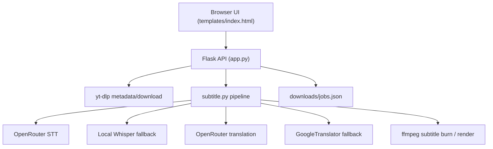

<h1 align="center">SubClip</h1>
<p align="center">Self-hosted media downloader with AI subtitle generation, styling, and burn-in rendering.</p>
<p align="center">
  <a href="TODO:docs-url">Docs</a> ·
  <a href="TODO:demo-url">Demo</a> ·
  <a href="TODO:releases-url">Releases</a>
</p>

<p align="center">
  
  
  
  
  
  
  
</p>

## Table of Contents

- [Features](#features)
- [Tech Stack](#tech-stack)
- [Architecture](#architecture)
- [Project Structure](#project-structure)
- [Getting Started](#getting-started)
- [Configuration](#configuration)
- [Usage](#usage)
- [API Overview](#api-overview)
- [Testing](#testing)
- [Deployment](#deployment)
- [Roadmap](#roadmap)
- [Contributing](#contributing)
- [Security](#security)
- [FAQ](#faq)
- [License](#license)
- [Acknowledgments](#acknowledgments)

## Features

- Download media from platforms supported by `yt-dlp`.
- Export as `MP4` (video) or `MP3` (audio).
- Inspect title, thumbnail, duration, uploader, and video quality options before download.
- Generate subtitles as:
  - sidecar `SRT`
  - burned-in subtitles (`MP4`)
  - both sidecar and burned-in output
- Subtitle styling controls:
  - font family
  - font size
  - text color
  - outline color
  - subtitle box color and opacity
- Live subtitle style preview in UI.
- Card-level style panel (`Show style` / `Hide style`) and per-card styling state.
- `Apply style` on existing subtitles without re-running AI transcription.
- Job history persisted in `downloads/jobs.json`.

## Tech Stack

- **Backend:** Python, Flask
- **Media download:** `yt-dlp`
- **Media processing:** `ffmpeg` / `ffprobe`
- **Transcription (cloud):** OpenRouter audio transcriptions API
- **Transcription (local fallback):** `faster-whisper`
- **Translation:** OpenRouter chat models or Google Translate fallback
- **Frontend:** single-page vanilla HTML/CSS/JS

## Architecture



## Project Structure

```text
reclip/
  app.py                  # Flask routes + job orchestration
  subtitle.py             # Subtitle generation and burn-in logic
  dub.py                  # Legacy dubbing module (kept in repo)
  elevenlabs_client.py    # Legacy dubbing helper (kept in repo)
  lipsync_client.py       # Legacy lipsync helper (kept in repo)
  templates/
    index.html            # Single-page UI
  static/
    favicon.svg
    subclip.ico
  downloads/              # Output files + jobs.json runtime state
  .env.example
  requirements.txt
  Dockerfile
  create_icon.py          # Desktop shortcut/icon helper
```

## Getting Started

### Prerequisites

- Python `3.10+` (recommended `3.12`)
- `ffmpeg` available in `PATH`
- Internet access for cloud STT/translation APIs

### Installation (Windows PowerShell)

```powershell
git clone <YOUR_REPO_URL>
cd reclip
python -m venv venv
.\venv\Scripts\Activate.ps1
pip install -r requirements.txt
```

Install ffmpeg (example):

```powershell
winget install --id Gyan.FFmpeg -e
```

### Run

```powershell
python app.py
```

Open: `http://127.0.0.1:8899`

## Configuration

Runtime settings are stored in `.env` and editable from the in-app settings modal.

### Common keys

- `OPENROUTER_API_KEY` (recommended for cloud STT + translation)
- `OPENROUTER_MODEL` (optional translation model override)
- `OPENROUTER_STT_MODEL` (optional STT model override, default `openai/whisper-large-v3-turbo`)
- `OPENROUTER_STT_CHUNK_SEC` (optional STT chunk length, default `30`)
- `GROQ_API_KEY` (currently kept for compatibility in settings)
- `PORT` (default `8899`)
- `HOST` (default `127.0.0.1`)

See full template: [`.env.example`](./.env.example)

## Usage

1. Paste one or more URLs.
2. Click `Fetch video`.
3. Choose format (`MP4` / `MP3`) and quality.
4. Click `Download`.
5. For video cards, use `Add subtitles`.
6. After subtitles exist, click `Show style` and adjust visual settings.
7. Click `Apply style` to re-render styling into video.

Notes:

- `Apply style` uses the existing subtitle file and does **not** trigger fresh AI transcription.
- Burn-in operations can take significant time on long videos because output is re-encoded.

## API Overview

### `POST /api/info`

Returns media metadata and quality candidates.

### `POST /api/download`

Starts media download, optionally followed by subtitle generation.

### `POST /api/subtitle/<job_id>`

Generates subtitles or reapplies style depending on payload (`restyle_only`).

### `GET /api/status/<job_id>`

Returns current job state, progress, and errors.

### `GET /api/file/<job_id>`

Downloads final media output.

### `GET /api/subtitle-file/<job_id>`

Downloads sidecar SRT.

### `GET /api/media/<job_id>`

Streams media for preview.

## Testing

Project currently uses smoke checks rather than a dedicated test suite.

```powershell
python -m py_compile app.py subtitle.py
```

Optional runtime smoke check:

```powershell
python -c "from app import app; c=app.test_client(); print(c.get('/').status_code)"
```

## Deployment

### Docker

```bash
docker build -t subclip .
docker run --rm -p 8899:8899 subclip
```

### Notes

- Mount a persistent volume for `downloads/` in production setups.
- Keep API keys in environment variables or a secrets manager.

## Roadmap

- [ ] Multi-language UI localization.
- [ ] Background worker queue for long-running jobs.
- [ ] Hardware-accelerated encode options (`h264_nvenc` / `hevc_nvenc`) detection.
- [ ] Automated integration tests for subtitle styling and restyle flow.

## Contributing

1. Fork the repository.
2. Create a branch.
3. Make focused commits with clear messages.
4. Open a PR with reproduction steps and screenshots for UI changes.

## Security

- Never commit real API keys.
- Use `.env` for local development secrets.
- Report vulnerabilities privately: `TODO:security-contact`.

## FAQ

### Why does `Apply style` still take long on long videos?

Because burned subtitles require full video re-encode with ffmpeg.

### Does `Apply style` call AI again?

No. It uses the existing SRT and only re-renders styled subtitle burn-in.

### Why do I not see style changes when mode is `SRT file`?

`SRT` sidecar mode does not embed style into video. Use `burn` or `both`.

### Which STT path is used first?

If `OPENROUTER_API_KEY` is set, OpenRouter STT is used first; local Whisper is fallback.

## License

MIT License. See [LICENSE](./LICENSE).

## Acknowledgments

- [yt-dlp](https://github.com/yt-dlp/yt-dlp)
- [FFmpeg](https://ffmpeg.org/)
- [OpenRouter](https://openrouter.ai)
- [faster-whisper](https://github.com/SYSTRAN/faster-whisper)
- [deep-translator](https://github.com/nidhaloff/deep-translator)
